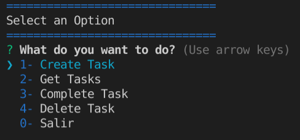
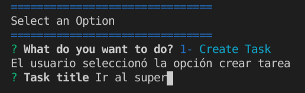

# 04-node-todo-app

Puedes crear tareas, obtener una lista de las creadas, colocarlas como completadas y eliminar las tareas finalizadas facilmente desde la linea de comandos

## Pantalla principal

Aqui veras las opciones disponibles:

- Crear tarea
- Obtener la lista de tareas
- Colocar tarea como completada
- Eliminar una tarea
- Salir

## Crear una tarea

Selecciona la opción 1 para crear una tarea, se te solicitará el titulo de la misma

## Notas

Agradecimiento especial a FerKtu por su curso de Node.js

Agradezco tu ínteres en este proyecto, si deseas ponerte en contacto o saber mas de mi te invito a que visites
mi perfil de [Linkedin](https://www.linkedin.com/in/gast%C3%B3n-martinez-a2189a1a2/)
